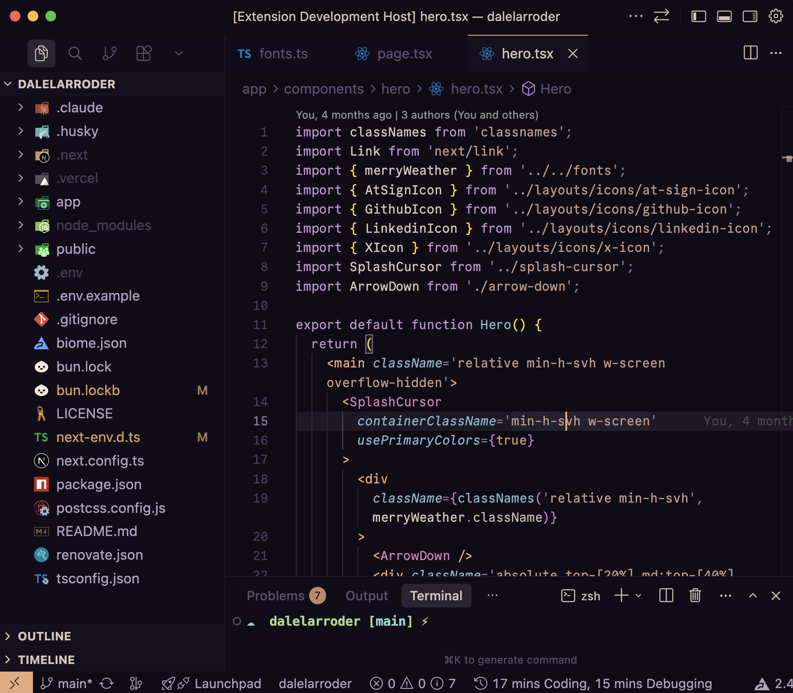

# Cozy Theme

A warm, cozy dark theme for VS Code that's easy on the eyes during long coding sessions.

## Preview



## Color Palette

| Role        | Color | Hex       |
| ----------- | ----- | --------- |
| Background  |  | `#110c17` |
| Foreground  |  | `#d4c5b9` |
| Accent      |  | `#e8a87c` |
| Keywords    |  | `#c491cf` |
| Functions   |  | `#82b8cc` |
| Strings     |  | `#c49a8a` |
| Constants   |  | `#d4a055` |
| Tags        |  | `#e8a87c` |
| Components  |  | `#d480b8` |
| Regex/Cyan  |  | `#6fbcb0` |

## Installation

### From VS Code Marketplace

1. Open **Extensions** sidebar in VS Code (`Ctrl+Shift+X` / `Cmd+Shift+X`)
2. Search for `Cozy Theme`
3. Click **Install**
4. Open **Command Palette** (`Ctrl+Shift+P` / `Cmd+Shift+P`)
5. Select **Preferences: Color Theme** → **Cozy Theme**

### From Source

1. Clone this repository into your VS Code extensions directory:
   ```bash
   git clone https://github.com/dlarroder/cozy-theme ~/.vscode/extensions/cozy-theme
   ```
2. Restart VS Code
3. Select the theme via **Preferences: Color Theme** → **Cozy Theme**

## Development

1. Open this folder in VS Code
2. Press `F5` to launch a new VS Code window with the theme loaded
3. Edit `themes/cozy-color-theme.json` to tweak colors
4. Reload the development window (`Ctrl+R` / `Cmd+R`) to see changes

## Packaging & Publishing

```bash
bun install
bun run package    # creates a .vsix file
bun run publish    # publishes to VS Code Marketplace
```

## License

[MIT](./LICENSE)
